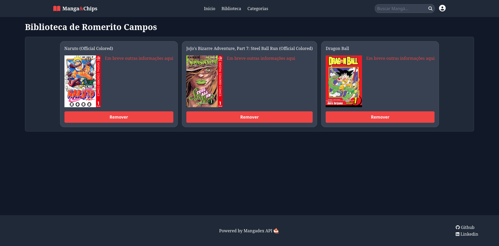
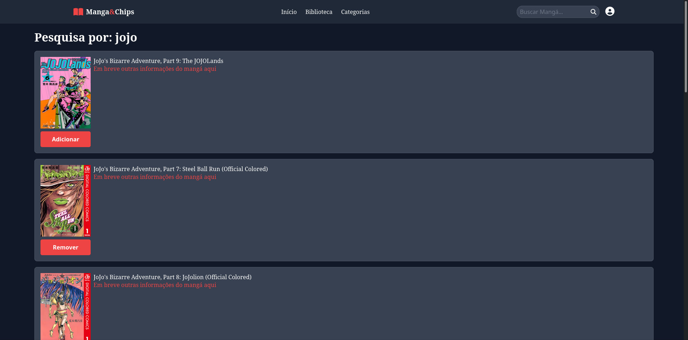

# manga-and-chips
Este site foi feito utilizando a API do MangaDex, todas as artes, páginas e dados dos mangás são tirados de lá.

## Dependências
- Python

## Rodando a aplicação
Para rodar a aplicação pela primeira vez, antes é necessário preparar o ambiente executando o módulo build.py. Após isso é só abrir o servidor com flask run.

**Todos os passos adiante devem ser realizados na pasta raiz do projeto** (manga-and-chips/)

<details>
  <summary>Linux</summary>
    
  - **Preparando o ambiente (faz apenas uma vez):**
     ```bash
     python3 build.py
     ```
  - **Iniciando o servidor:**
     ```bash
     flask run
     ```
</details>

<details>
  <summary>Windows</summary>
    
  - **Preparando o ambiente (faz apenas uma vez):**
     ```bash
     py build.py
     ```
     ou
     ```bash
     python build.py
     ```
    
  - **Iniciando o servidor:**
     ```bash
     flask run
     ```
</details>



